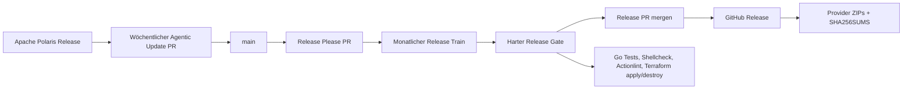
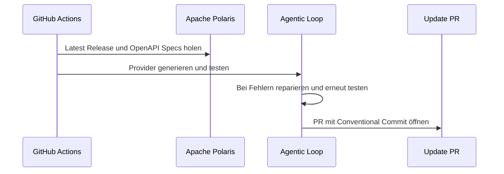
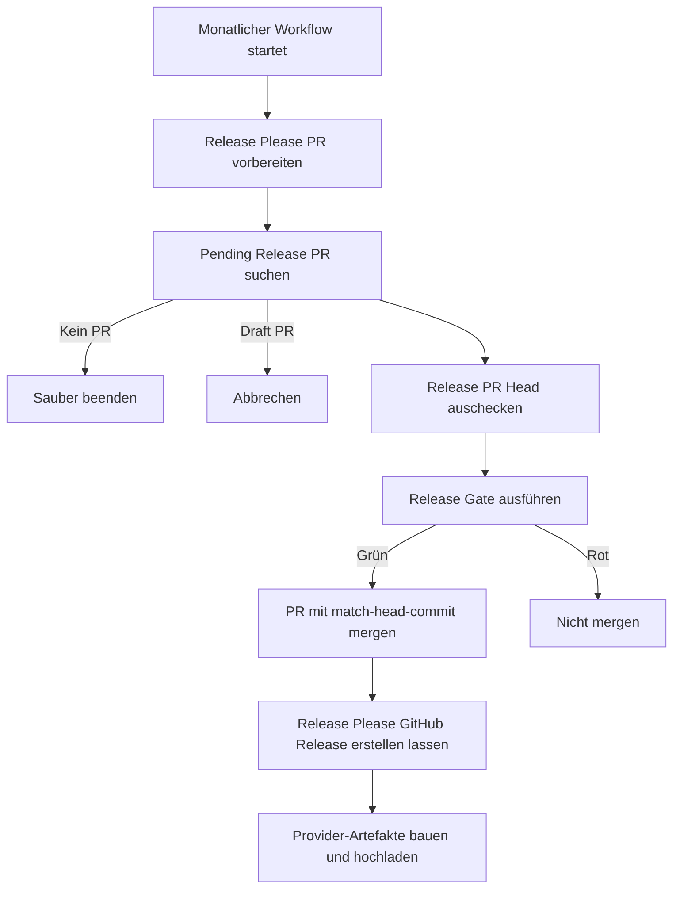

# Release-Betrieb

Dieses README erklärt, wie die Releases in diesem Repository funktionieren. Die Grundidee ist bewusst ruhig:

```text
Jede Woche vorbereiten.
Einmal pro Monat releasen.
Nur releasen, wenn der Provider gegen echte Polaris-Infrastruktur grün ist.
```

## Überblick



Es gibt drei Workflows:

| Workflow | Zweck |
| --- | --- |
| `.github/workflows/agentic-update.yml` | Prüft wöchentlich Apache Polaris, generiert den Provider neu und öffnet einen PR. |
| `.github/workflows/release.yml` | Lässt Release Please den nächsten Release-PR vorbereiten oder aktualisieren. Wenn ein Release entsteht, werden Provider-Artefakte hochgeladen. |
| `.github/workflows/monthly-release.yml` | Führt einmal pro Monat den kontrollierten Release-Train aus: validieren, mergen, releasen, Artefakte hochladen. |

## Warum nicht jede Woche releasen?

Der Provider trackt Polaris automatisch. Das ist gut für Geschwindigkeit, aber Releases sollen stabil bleiben. Darum landen wöchentliche Änderungen zuerst in einem normalen PR und danach in einem Release-PR. Der monatliche Release-Train bündelt diese Änderungen zu einem nachvollziehbaren GitHub Release.

Das gibt uns:

- weniger Release-Rauschen für Nutzer
- klare SemVer-Versionen
- ein gepflegtes `CHANGELOG.md`
- einen finalen Infrastruktur-Test vor jedem Release
- eine einfache Stelle, um einen Release zu stoppen, falls etwas unsauber aussieht

## Wöchentlicher Update-Prozess



Der Update-PR verwendet absichtlich Conventional Commits:

```text
feat(polaris): update generated Terraform provider
```

Dadurch erkennt Release Please, dass diese Änderung in den nächsten Release gehört.

## Release Please

Release Please liest die gemergten Conventional Commits und pflegt daraus:

- `CHANGELOG.md`
- `.release-please-manifest.json`
- den Release-PR
- den GitHub Release mit Tag `vX.Y.Z`

Die Konfiguration liegt hier:

- `release-please-config.json`
- `.release-please-manifest.json`

Der Guard `scripts/check_release_please_config.sh` prüft in CI, dass die wichtigsten Regeln stimmen:

- Root Package ist ein Go Release
- Tags heißen plain `vX.Y.Z`
- Manifest-Version ist gültig

## SemVer-Regeln

Für normale Releases gelten diese Commit-Typen:

| Commit | Wirkung |
| --- | --- |
| `fix:` | Patch Release |
| `feat:` | Feature Release |
| `feat!:` / `fix!:` | Breaking Release |
| `chore:` / `ci:` / `docs:` | Kein Release-Zwang |

Solange das Projekt unter `1.0.0` ist, ist die Versionierung konservativer konfiguriert:

- `feat:` erhöht nur Patch
- Breaking Changes erhöhen Minor
- Patch Fixes bleiben Patch

Das passt besser zu einem frühen Provider, der noch schnell dazulernt.

## Monatlicher Release-Train

Der monatliche Workflow läuft am ersten Tag des Monats und kann manuell gestartet werden.



Der wichtigste Schutz ist `--match-head-commit`: Gemerged wird nur der Commit, der vorher validiert wurde. Wenn der Release-PR während der Prüfung geändert wird, schlägt der Merge fehl.

## Release Gate

Vor dem Merge des Release-PRs laufen:

```bash
go mod download
scripts/check_release_please_config.sh
bash -n scripts/*.sh
shellcheck scripts/*.sh
actionlint -color=false .github/workflows/*.yml
scripts/agentic_infra_loop.sh
```

`scripts/agentic_infra_loop.sh` führt wiederum aus:

- `make generate`
- `make fmt`
- `make test`
- `make build`
- ADR-Guard
- Static-Coverage-Guard
- echter Terraform `apply`
- echter Terraform `destroy`

Der Terraform-Test läuft gegen einen echten Apache Polaris Container. Der Provider muss also nicht nur kompilieren, sondern tatsächlich einen Polaris Catalog anlegen und wieder löschen können.

## GitHub Release Artefakte

Release Please erstellt den GitHub Release und den Tag. Danach baut `scripts/build_release_artifacts.sh` die Provider-Binaries.

Aktuell werden diese Plattformen gebaut:

```text
linux_amd64
linux_arm64
darwin_amd64
darwin_arm64
```

Die Assets heißen:

```text
terraform-provider-polaris_<version>_<os>_<arch>.zip
terraform-provider-polaris_<version>_SHA256SUMS
```

## Secrets

Für den agentic Reparatur-Loop:

```text
OPENAI_API_KEY
```

Für die saubere Release-Automation:

```text
RELEASE_PLEASE_TOKEN
```

`RELEASE_PLEASE_TOKEN` sollte ein fein eingeschränkter GitHub Token sein, der Pull Requests erstellen/mergen und Releases erstellen darf. Ohne diesen Token fällt der Workflow auf `GITHUB_TOKEN` zurück. Das funktioniert teilweise, aber GitHub startet keine Folge-Workflows aus Events, die vom `GITHUB_TOKEN` erzeugt wurden. Für protected branches und saubere Checks ist ein eigener Token deshalb stabiler.

## Repo-Einstellungen

Empfohlen:

- Branch Protection auf `main`
- CI, Security und Test Catalog als required checks
- Auto-merge erlaubt
- Actions default token permissions auf read-only
- Secret scanning und Push protection aktiv
- Force-push und Branch deletion auf `main` blockiert

Die Workflows fordern Write-Rechte nur dort an, wo sie PRs, Releases oder Release-Artefakte erstellen müssen.

## Manueller Betrieb

Release-PR vorbereiten:

```text
Run workflow: Release Please
```

Monatlichen Release sofort auslösen:

```text
Run workflow: Monthly Release Train
```

Release-Artefakte lokal testen:

```bash
scripts/build_release_artifacts.sh 0.0.999-test dist/release-smoke
```

Danach kann `dist/release-smoke` wieder gelöscht werden.

## Fehlerfälle

Wenn kein Release-PR offen ist, beendet sich der monatliche Workflow ohne Release.

Wenn der Release-PR ein Draft ist, bricht der monatliche Workflow ab. Draft bedeutet: bewusst noch nicht automatisch releasen.

Wenn Tests oder der echte Polaris Apply/Destroy fehlschlagen, wird nicht gemerged und kein GitHub Release erstellt.

Wenn Release Please keinen neuen Release erstellt, werden keine Artefakte hochgeladen.

## Betriebliches Prinzip

Polaris kann sich schnell ändern. Dieses Repo soll schnell reagieren, aber langsam releasen:

```text
Schnell lernen.
Hart testen.
Monatlich stabil veröffentlichen.
```
